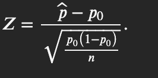
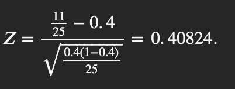

# IEE-380-Project
This is a class project for my IEE 380: Probability and Statistics for Engineers class. 

# Divorce Rate Analysis in 2015

## Project Overview
This project examines the divorce rate in 2015 for most countries. I hypothesized that the divorce rate for most countries in 2015, using a 95% confidence interval, is 0.4 (40%). 

To validate this hypothesis, I analyzed a dataset from [Our World in Data](https://ourworldindata.org/marriages-and-divorces) that included divorce rates for several nations over multiple years. Specifically, I focused on data from 25 countries in 2015, exported into this [Excel sheet](https://docs.google.com/spreadsheets/d/1l-4iN82C6U6occW0CI0Mv32FFb5HgBHtj2QDEWGtbnA/edit).

---

## Hypothesis
- **Null Hypothesis (\(H_0\))**: The divorce rate for most countries in 2015 is 0.4 (40%).
- **Alternative Hypothesis (\(H_1\))**: The divorce rate for most countries in 2015 exceeds 0.4 (40%).

---

## Methodology
1. **Dataset Selection**:
   - Data was sourced from the [Our World in Data website](https://ourworldindata.org/marriages-and-divorces](https://ourworldindata.org/marriages-and-divorces ).
   - Focused on the graph titled *"Divorces per 1,000 people"* and filtered data for 25 countries in 2015.

2. **Data Preparation**:
   - Exported the required data into [this Excel sheet](https://docs.google.com/spreadsheets/d/1l-4iN82C6U6occW0CI0Mv32FFb5HgBHtj2QDEWGtbnA/edit](https://docs.google.com/spreadsheets/d/1l-4iN82C6U6occW0CI0Mv32FFb5HgBHtj2QDEWGtbnA/edit).
   - Identified 11 out of 25 countries with a divorce rate of 40% or higher.

3. **Confidence Interval**:
   - Calculated a one-sided upper confidence interval to test if the divorce rate exceeds 40%.
   - Formula: 
     \[
     
     \]
   - Inputs:
     
     - \(z_a = 1.645\) (for 95% confidence level)
   - Result:
     \[
     
     \]

4. **Hypothesis Test**:
   - Test statistic formula:
     \[
     
     \]
   - Inputs:
     , \(n = 25\)
   - Result:
     \[
     
     \]

---

## Results
- \(Z_0 = 0.4084\) and \(z_a = 1.645\)
- Since \(Z_0 < z_a\), we **fail to reject the null hypothesis**.

---

## Conclusion
The data suggests that the divorce rate does not exceed 40% for most countries in 2015. This aligns with expectations, considering societal norms and perceptions of divorce in 2015. However, as societal attitudes toward divorce have shifted, a similar hypothesis might yield different results in 2024.

---

## Future Work
- Revisit the hypothesis with recent data from 2024 to explore how societal changes may have impacted divorce rates globally.
- Expand the analysis to include other related factors like marriage rates, cultural influences, and legal systems.

---
